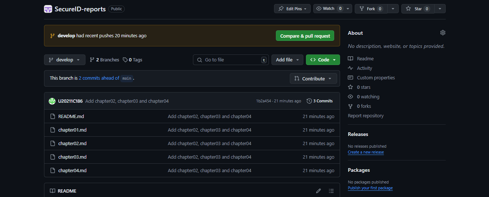

### Universidad Peruana de Ciencias Aplicadas
### SI728 | WX83 | Arquitecturas De Software Emergentes
### Profesor: Royer Edelwer Rojas Malasquez
### Ingeniería de Software
.
# SecureID
### TB1 REPORT - IDBlock
================================
#### Team members
- Pastrana León, Aldo Francisco (U20211C186)

#### Ciclo 2024-02

---
# Registro de Versiones del Informe
| 
Versión
 | 
Fecha
 | 
Autor
 | Descripción de modificación |
|:---------:|:-------:|:-------:|-----------------------------|
| **v1.1** | 04-04-2024 | IDBlock | Para esta versión, hemos priorizado los capítulos que abordan directamente la startup, el problema a resolver y el producto que se planea desarrollar. Además, hemos definido con mayor claridad los segmentos objetivos y hemos llevado a cabo un proceso de investigación para identificar las necesidades del mercado, conocido como "needfinding". |
---
# Project Report Collaboration Insights

**Project Report**

Link: https://github.com/IDBlock-WX83/SecureID-reports

TB1: El equipo ha abordado con éxito los puntos requeridos para la entrega solicitada. Durante el proceso de adaptación al entorno documental, nos enfrentamos a algunos desafíos al estructurar y convertir el archivo. Sin embargo, a pesar de estos contratiempos, nos complace informar que logramos alcanzar los objetivos establecidos.

> Analíticos para el TB1

---
# Contenido
- [Capítulo I: Introducción](/chapter01.md#capítulo-i-introducción)
  - [1.1. Startup Profile](/chapter01.md#11-startup-profile)
    - [1.1.1. Descripción de la Startup](/chapter01.md#111-descripción-de-la-startup)
    - [1.1.2. Perfiles de integrantes del equipo](/chapter01.md#112-perfiles-de-integrantes-del-equipo)
  - [1.2. Solution Profile](/chapter01.md#12-solution-profile)
    - [1.2.1 Antecedentes y problemática](/chapter01.md#121-antecedentes-y-problemática)
    - [1.2.2 Lean UX Process](/chapter01.md#122-lean-ux-process)
      - [1.2.2.1. Lean UX Problem Statements](/chapter01.md#1221-lean-ux-problem-statements)
      - [1.2.2.2. Lean UX Assumptions](/chapter01.md#1222-lean-ux-assumptions)
      - [1.2.2.3. Lean UX Hypothesis Statements](/chapter01.md#1223-lean-ux-hypothesis-statements)
      - [1.2.2.4. Lean UX Canvas](/chapter01.md#1224-lean-ux-canvas)
  - [1.3. Segmentos objetivo](/chapter01.md#13-segmentos-objetivo)
- [Capítulo II: Requirements Elicitation \& Analysis](/chapter02.md#capítulo-ii-requirements-elicitation--analysis)
  - [2.1. Competidores](/chapter02.md#21-competidores)
    - [2.1.1. Análisis competitivo](/chapter02.md#211-análisis-competitivo)
    - [2.1.2. Estrategias y tácticas frente a competidores](/chapter02.md#212-estrategias-y-tácticas-frente-a-competidores)
  - [2.2. Entrevistas](/chapter02.md#22-entrevistas)
    - [2.2.1. Diseño de entrevistas](/chapter02.md#221-diseño-de-entrevistas)
    - [2.2.2. Registro de entrevistas](/chapter02.md#222-registro-de-entrevistas)
    - [2.2.3. Análisis de entrevistas](/chapter02.md#223-análisis-de-entrevistas)
  - [2.3. Needfinding](/chapter02.md#23-needfinding)
    - [2.3.1. User Personas](/chapter02.md#231-user-personas)
    - [2.3.2. User Task Matrix](/chapter02.md#232-user-task-matrix)
    - [2.3.3. Empathy Mapping](/chapter02.md#233-empathy-mapping)
    - [2.3.4. As-is Scenario Mapping](/chapter02.md#234-as-is-scenario-mapping)
  - [2.4. Ubiquitous Language](/chapter02.md#24-ubiquitous-language)
- [Capítulo III: Requirements Specification](/chapter03.md#capítulo-iii-requirements-specification)
  - [3.1. To-Be Scenario Mapping](/chapter03.md#31-to-be-scenario-mapping)
  - [3.2. User Stories](/chapter03.md#32-user-stories)
  - [3.3. Impact Mapping](/chapter03.md#33-impact-mapping)
  - [3.4. Product Backlog](/chapter03.md#34-product-backlog)
- [Capítulo IV: Strategic-Level Software Design](/chapter04.md#capítulo-iv-strategic-level-software-design)
  - [4.1. Strategic-Level Attribute-Driven Design](/chapter04.md#41-strategic-level-attribute-driven-design)
    - [4.1.1. Design Purpose](/chapter04.md#411-design-purpose)
    - [4.1.2. Attribute-Driven Design Inputs](/chapter04.md#412-attribute-driven-design-inputs)
      - [4.1.2.1 Primary Functionality (Primary User Stories)](/chapter04.md#4121-primary-functionality-primary-user-stories)
      - [4.1.2.2 Quality attribute Scenarios](/chapter04.md#4122-quality-attribute-scenarios)
      - [4.1.2.3 Constraints](/chapter04.md#4123-constraints)
    - [4.1.3. Architectural Drivers Backlog](/chapter04.md#413-architectural-drivers-backlog)
    - [4.1.4. Architectural Design Decisions](/chapter04.md#414-architectural-design-decisions)
    - [4.1.5. Quality Attribute Scenario Refinements](/chapter04.md#415-quality-attribute-scenario-refinements)
  - [4.2. Strategic-Level Domain-Driven Design](/chapter04.md#41-strategic-level-domain-driven-design)
    - [4.2.1. EventStorming](/chapter04.md#421-eventStorming)
    - [4.2.2. Candidate Context Discovery](/chapter04.md#422-candidate-context-discovery)
    - [4.2.3. Domain Message Flows Modeling](/chapter04.md#423-domain-message-flows-modeling)
    - [4.2.4. Bounded Context Canvases](/chapter04.md#424-bounded-context-canvases)
    - [4.2.5. Context Mapping](/chapter04.md#425-context-mapping)
  - [4.3. Software Architecture](/chapter04.md#43-software-architecture)
    - [4.3.1. Software Architecture System Landscape Diagram](/chapter04.md#431-software-architecture-system-landscape-diagram)
    - [4.3.2. Software Architecture Context Level Diagrams](/chapter04.md#432-software-architecture-context-level-diagrams)
    - [4.3.3. Software Architecture Container Level Diagrams](/chapter04.md#433-software-architecture-container-level-diagrams)
    - [4.3.4. Software Architecture Deployment Diagrams](/chapter04.md#434-software-architecture-deployment-diagrams)