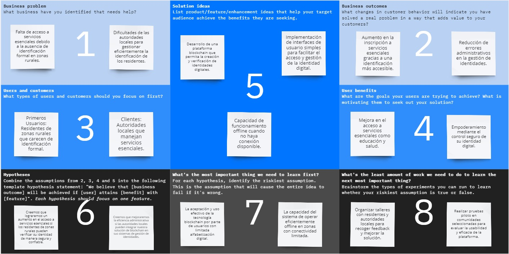

# Capítulo I: Introducción
---
## 1.1. Startup Profile
---
### 1.1.1. Descripción de la Startup

IDBlock es una innovadora startup tecnológico que utiliza tecnología blockchain para mejorar el acceso a los servicios esenciales en las áreas rurales de la sierra del Perú. SecureID es nuestra solución insignia, una plataforma web equipada con tecnología de vanguardia que implementa una blockchain privada para crear y gestionar identificaciones digitales. Dicha identificación permite a los residentes de zonas remotas acceder a servicios esenciales como educación, salud pública y asistencia social, superando las barreras de la falta de documentación convencional y mejorando la inclusión social.

**Misión:**

En IDBlock, nuestra misión es fortalecer a las comunidades rurales mediante tecnologías avanzadas de identificación digital. Nos comprometemos a proporcionar soluciones accesibles que aseguren el acceso equitativo a servicios esenciales, facilitando así una mayor inclusión y justicia social en las áreas más desatendidas de la sierra del Perú.

**Visión:**

Ser la marca líder en soluciones de identidad digital basadas en blockchain para comunidades rurales a nivel nacional. Aspiramos a crear un modelo sostenible y replicable que transforme la accesibilidad a servicios esenciales, promoviendo el desarrollo integral y sostenible de las comunidades más vulnerables.

### 1.1.2. Perfiles de integrantes del equipo
| Aldo Francisco Pastrana León |  |
|----------|----------|
|Me llamo Aldo Francisco Pastrana León de la carrera de Ingeniería de Software y actualmente me encuentro en el octavo ciclo de mi carrera. Soy de Lima, tengo 22 años y me gustan las matemáticas. Además, mis pasatiempos son ver series, programar y videojuegos. Elegí mi carrera debido a que gusta la creación de los diversos programas y aplicaciones que existen. Además, para este curso me comprometo a ayudar en todo lo posible para la elaboración de este proyecto cumpliendo con mis responsabilidades.| |
|||

## 1.2. Solution Profile
---
### 1.2.1 Antecedentes y problemática

**What (Qué)**

En muchas áreas rurales de la sierra del Perú, la falta de identificación formal es una barrera significativa que impide el acceso de los residentes a servicios esenciales como educación, salud pública y asistencia social. Este problema se agrava por las dificultades logísticas y burocráticas que enfrentan estas comunidades para obtener y verificar documentos de identidad convencionales, así como por la escasa infraestructura de telecomunicaciones. “En el Perú, un 4% no cuenta con estaciones base celulares y un 31% no cuenta con nodos de fibra óptica” (Ministerio de Transportes y Comunicaciones, 2023). Sin un sistema de identificación eficiente y confiable, los habitantes de estas zonas están a menudo marginados y no pueden aprovechar los recursos que podrían mejorar significativamente su calidad de vida.

**When (Cuándo)**

El problema de la falta de identificación formal en las áreas rurales de la sierra del Perú se hace más evidente en momentos críticos cuando los residentes requieren acceso a servicios esenciales. Estos incluyen la matriculación escolar al inicio del año académico, la solicitud de servicios médicos durante emergencias de salud, y la búsqueda de asistencia social en tiempos de crisis económica o desastres naturales. La estacionalidad agrava estos problemas, como durante las temporadas de siembra y cosecha cuando los recursos son más necesarios. Un dato alarmante del Banco Mundial en 2023 revela que “siete de cada 10 personas que necesitaron atención médica no la obtuvieron”, subrayando la urgencia de abordar este problema para mejorar el acceso a servicios esenciales.

**Where (Dónde)**

La problemática de la falta de identificación formal se concentra principalmente en las zonas rurales de la sierra del Perú, donde las infraestructuras básicas y los servicios esenciales son limitados o inaccesibles. Estas áreas se caracterizan por su difícil geografía, lo que dificulta aún más la llegada de asistencia y la implementación de programas de identificación convencionales. Además, en algunas comunidades rurales, existe resistencia cultural al cambio y a la adopción de nuevas tecnologías, lo que puede representar un obstáculo adicional para la introducción de soluciones digitales. Según Unidad Latina (2024), esta resistencia es un factor crucial a considerar al diseñar e implementar tecnologías que requieran aceptación comunitaria y adaptación cultural.

**Who (Quién)**

Los segmentos de mercado de nuestro proyecto son los residentes en las zonas rurales de la sierra del Perú y las autoridades locales de dichas zonas rurales.

Para el primer segmento, nos dirigimos a los residentes locales que viven en áreas donde el acceso a servicios básicos como salud, educación y asistencia social está limitado debido a la falta de identificación formal. Nuestro objetivo es proporcionarles una solución de identificación digital accesible que facilite su inclusión en programas y servicios esenciales.

Para el segundo segmento, nos dirigimos a las autoridades locales para implementar y gestionar el sistema de identificación digital. Este segmento incluye funcionarios y administradores de programas de asistencia social, quienes se benefician de un sistema más eficiente y transparente para verificar la identidad de los residentes y distribuir los recursos adecuadamente.

Al enfocarnos en estos segmentos, buscamos crear un ecosistema digital que no solo mejore el acceso a servicios esenciales para los residentes de estas áreas, sino que también proporcione a las autoridades locales las herramientas necesarias para gestionar eficazmente la identificación y los recursos. Esta integración permite una mejora sustancial en la calidad de vida de las personas y optimiza la distribución de ayuda y servicios esenciales.

**Why (Por qué)**

La implementación de una solución de identificación digital en las zonas rurales de la sierra del Perú es esencial debido a la falta de acceso a servicios esenciales como educación, salud y asistencia social, exacerbada por la ausencia de documentos de identidad formales. Esto no solo agranda la desigualdad y limita el desarrollo socioeconómico, sino que también presenta desafíos administrativos significativos para las autoridades locales en la gestión y verificación de identidades. La tecnología blockchain ofrece una alternativa segura, transparente y eficiente, proporcionando una plataforma inmutable y descentralizada que puede mejorar la eficiencia administrativa y cerrar la brecha de exclusión en estas comunidades. Además, considerando que "en áreas rurales solo el 5.9% tiene internet y el 7.5%, un ordenador" (El Peruano, 2021), es imperativo buscar soluciones que no dependan enteramente de la infraestructura de telecomunicaciones existente.

**How (Cómo)**

Para abordar la problemática de la falta de identificación formal en las áreas rurales de la sierra del Perú, desarrollaremos una plataforma de blockchain privada llamada SecureID. Esta plataforma funcionará incluso con conectividad limitada, utilizando tecnología de almacenamiento y sincronización local que permite operar offline. SecureID almacenará de manera segura los datos de identificación personal en una red distribuida, asegurando su inmutabilidad y protección de datos. Además, implementaremos interfaces de usuario sencillas y accesibles para que los residentes locales puedan gestionar fácilmente su identificación digital, incluso sin conocimientos técnicos avanzados. También colaboraremos con las autoridades locales para asegurar la integración del sistema con los servicios existentes, facilitando así un acceso más equitativo a servicios esenciales como educación y salud. 

**How Much (Cuánto)**

La falta de identificación formal en las áreas rurales de la sierra del Perú afecta diariamente a cientos de personas que intentan acceder a servicios básicos. Se estima que cada mes, miles de transacciones y solicitudes de servicios como educación, atención médica y asistencia social se ven obstaculizadas o denegadas debido a la ausencia de documentos de identidad válidos. En términos económicos, esta problemática implica costos significativos tanto para los individuos afectados como para el estado. Los individuos pierden oportunidades de mejora en calidad de vida y acceso a servicios. Además, de la ineficiencia administrativa y los errores en la gestión de identidades.

### 1.2.2 Lean UX Process
---
#### 1.2.2.1. Lean UX Problem Statements

Estado actual: En las áreas rurales de la sierra del Perú, la falta de identificación formal impide que los residentes accedan a servicios esenciales como educación, salud y asistencia social. Las soluciones de identificación existentes no abordan las limitaciones geográficas y tecnológicas de estas áreas, ni cumplen con las necesidades específicas de accesibilidad de los residentes rurales.

Deficiencia en los servicios actuales: Los sistemas de identificación actuales no logran proporcionar una solución accesible y segura que sea capaz de funcionar con conectividad limitada, y no son lo suficientemente flexibles para adaptarse a las necesidades particulares de las comunidades rurales. Además, carecen de la capacidad de integrarse eficientemente con los servicios existentes, lo que agrava la exclusión y la desigualdad social.

Nuestro producto: Nuestro producto, una plataforma de identificación digital basada en blockchain llamada SecureID, abordará estas deficiencias al ofrecer una solución segura y descentralizada. Esta plataforma permitirá la verificación y gestión de identidades de manera eficaz, asegurando que los residentes puedan acceder a servicios esenciales sin las barreras actuales.

Enfoque inicial: Nuestro enfoque inicial estará en los residentes de las zonas rurales de la sierra del Perú, quienes se enfrentan a los mayores desafíos en términos de acceso a servicios esenciales. Asimismo, trabajaremos con autoridades locales para garantizar la integración de nuestra solución con los sistemas existentes, maximizando la eficacia y la adaptabilidad de la plataforma.

Indicadores de éxito: Sabremos que hemos tenido éxito cuando observamos una mejora significativa en el acceso a servicios esenciales por parte de los residentes, una reducción en la incidencia de problemas administrativos relacionados con la identificación y una mayor satisfacción de las autoridades locales con la gestión de identidades. Además, buscaremos una adopción amplia de la plataforma y testimonios positivos de las comunidades que reflejan una mejora tangible en su calidad de vida y acceso a servicios.

#### 1.2.2.2. Lean UX Assumptions

**User Outcome:**

* Mejora en la autenticación y el acceso a servicios esenciales: Los residentes de áreas rurales experimentaron un proceso más fluido y seguro para verificar su identidad y acceder a servicios como educación, salud y asistencia social.

* Empoderamiento a través del control de datos personales: Los usuarios tendrán control sobre sus datos personales a través de una plataforma de blockchain, lo que aumenta su confianza y seguridad en la gestión de su identidad digital.

* Mayor inclusión y equidad social: La plataforma facilitará una mayor inclusión de los residentes de zonas rurales en programas del estado y servicios que anteriormente eran inaccesibles debido a la falta de identificación formal.

**Business Outcome:**

* Mejora en la eficiencia administrativa: La implementación de blockchain proporcionará un sistema seguro para las autoridades locales, reduciendo los errores administrativos.

* Fortalecimiento de la relación entre gobierno y ciudadanos: Al mejorar la accesibilidad y la eficacia de los servicios esenciales, la plataforma incrementará la satisfacción y la confianza de los ciudadanos hacia las instituciones.

* Posicionamiento como líder en soluciones de identidad digital: El proyecto busca establecerse como referente en la implementación de soluciones de identidad digital basadas en blockchain para áreas con limitaciones tecnológicas.

**Features:**

* Sistema de gestión de identidad descentralizado: La plataforma utilizará blockchain para crear un registro seguro, inmutable y descentralizado de identidades.

* Interfaces de usuario adaptadas a bajos niveles de alfabetización digital: Desarrollo de interfaces simples e intuitivas que no requieran habilidades tecnológicas avanzadas para su uso.

* Capacidad de funcionamiento offline: Permitirá el uso de la plataforma sin necesidad de una conexión constante a internet, crucial en áreas con conectividad limitada.

* Integración con servicios locales y programas de asistencia: Facilitará la conexión directa con sistemas existentes para una gestión eficiente de los servicios.

* Funciones de seguridad para proteger datos personales: Implementará tecnologías en seguridad para asegurar la privacidad y protección de los datos de los usuarios.

#### 1.2.2.3. Lean UX Hypothesis Statements

* Creemos que lograremos una mejora en el acceso a servicios esenciales (salud, educación, asistencia social) para los residentes de áreas rurales si implementamos un sistema de identificación digital basado en blockchain que permita la verificación de identidad segura y descentralizada.

* Creemos que aumentaremos la confianza y el control sobre los datos personales de los residentes de áreas rurales si les ofrecemos una plataforma que les permita gestionar su identificación digital de manera segura.

* Creemos que mejoraremos la eficiencia administrativa en programas del estado si integramos nuestra solución de identificación digital con los sistemas existentes de servicios públicos.

* Creemos que reduciremos los costos administrativos y de gestión de identidades para las autoridades locales si implementamos una solución de blockchain que automatice y asegure el proceso de verificación de identidades.

* Creemos que lograremos una alta adopción de la plataforma de identificación digital en las comunidades rurales si diseñamos una interfaz de usuario intuitiva y proporcionamos capacitación y soporte adecuados a los usuarios finales.

#### 1.2.2.4. Lean UX Canvas

|

## 1.3. Segmentos objetivo
---